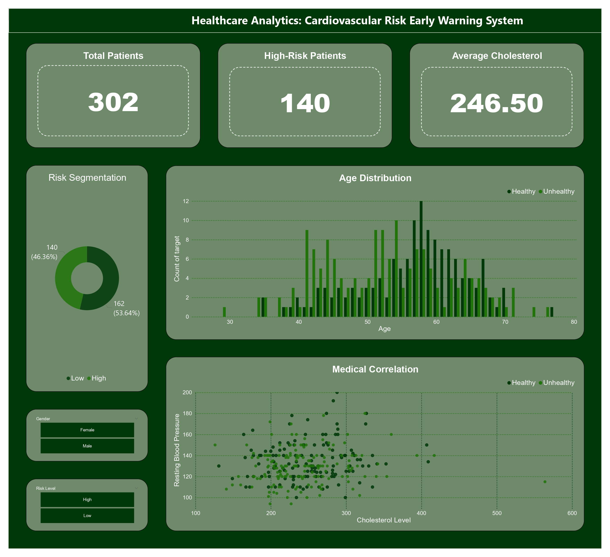

# 🏥 Healthcare Analytics: Cardiovascular Risk Early Warning System

---

## 🎯 Business Objective

This project aims to transform raw patient health data into actionable insights for **early detection of cardiovascular disease risk**.

The main objectives include:

* **Data Integrity**
  Cleaning and preprocessing patient data, handling missing values and inconsistencies from the original dataset.

* **Risk Identification**
  Identifying high-risk patients based on key health indicators such as cholesterol, blood pressure, and age.

* **Health Insight Generation**
  Discovering patterns and correlations between medical variables to support preventive healthcare decisions.

---

## 🛠️ Tech Stack

* **Language:** Python (Pandas, NumPy, Matplotlib, Seaborn)
* **Database:** PostgreSQL (Data storage & SQL querying)
* **Environment:** uv (Modern dependency & environment management)
* **Analysis:** Jupyter Notebook
* **Visualization:** Power BI (Interactive Dashboard)
* **Version Control:** Git

---

## 🔄 Data Pipeline

This project implements a simple end-to-end data workflow:

1. Raw dataset obtained in **CSV format from Kaggle**
2. Data imported into **PostgreSQL**
3. Data queried using **SQL**
4. Processed using **Python (Pandas)**
5. Visualized using **Power BI**

This pipeline simulates a real-world data workflow beyond basic CSV analysis.

---

## 📂 Dataset Information

The dataset used in this project is publicly available on Kaggle:

* **Heart Disease Dataset**
  https://www.kaggle.com/datasets/johnsmith88/heart-disease-dataset

Due to GitHub file size limitations, only processed/sample data may be included in this repository.

---

## 💡 Key Insights

Based on the analysis and dashboard:

* **High-Risk Population**
  Approximately **46% of patients are classified as high risk**, indicating a significant need for early intervention.

* **Health Correlation**
  A strong relationship exists between **high cholesterol and blood pressure**, which are key contributors to cardiovascular risk.

* **Age Factor**
  Patients aged **50–60 years** show a significantly higher risk level compared to other age groups.

---

## 📊 Dashboard Preview



---

## ⚙️ Project Structure

```bash id="gq6k6c"
portfolio_kesehatan/
├── data/
├── notebooks/
├── src/
├── reports/
│   ├── powerbi/
│   └── images/
├── main.py
├── pyproject.toml
├── uv.lock
├── .gitignore
└── README.md
```

---

## 🚀 Project Highlights

* Implements a **realistic data pipeline (CSV → PostgreSQL → SQL → Python → Power BI)**
* Uses **modern Python environment (uv)** instead of traditional pip
* Applies **clean code practices** with modular structure (`src/`)
* Focuses on **business-oriented insights**, not just technical analysis

---

## 📬 Contact

* GitHub: https://github.com/its-na
* Email: [alfinsyahrinafina@gmail.com](mailto:your_email@example.com)
